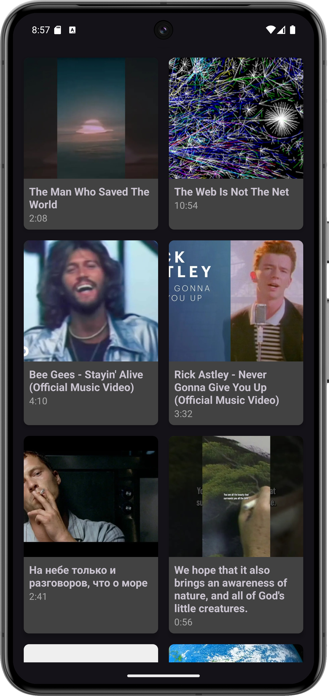
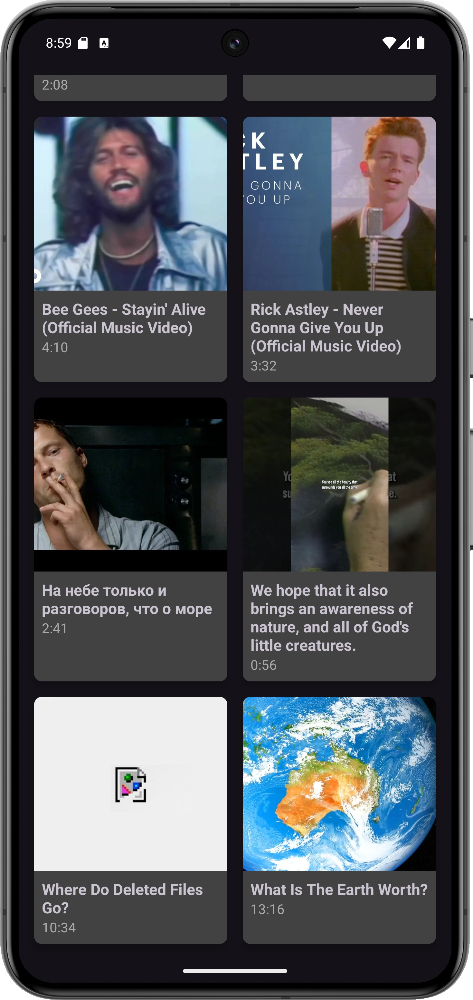
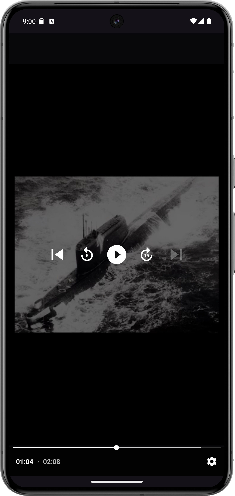
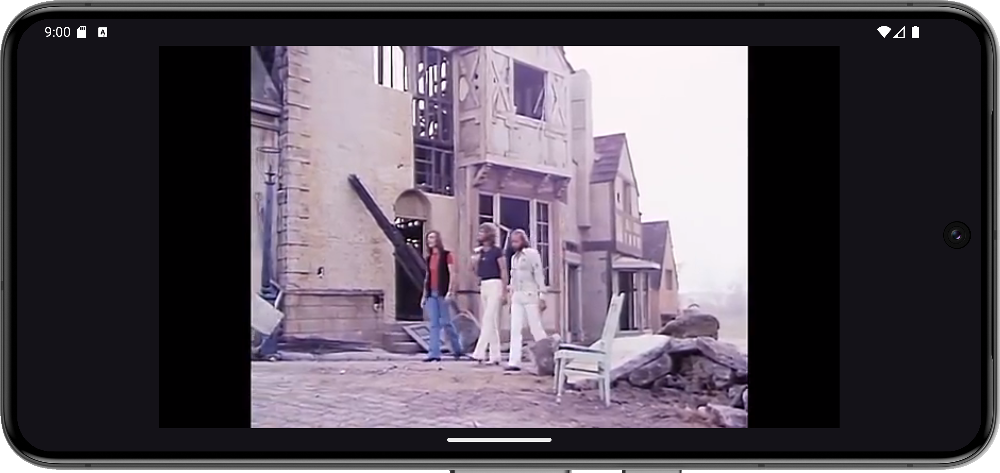
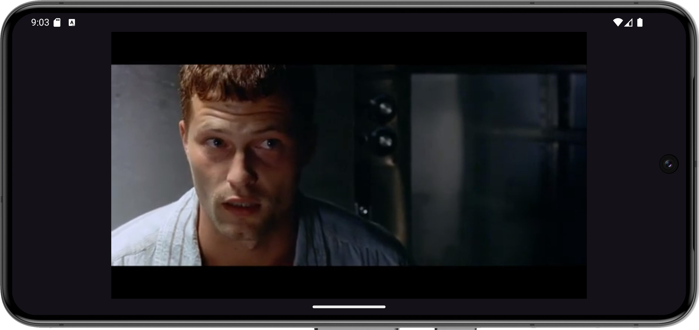

VK Video Trainee 🎥

VK Video Trainee is an Android application for browsing and playing videos. It features a modern UI with a video list screen and a media player built using Media3 ExoPlayer. Videos are fetched from a remote API using Retrofit, and thumbnails are displayed with Glide, extracting frames if no thumbnail is provided.

Technologies Used 🛠

Jetpack Navigation
Retrofit
Media3 ExoPlayer
Glide – Image loading
Koin
Mockk

Screenshoots 📸

